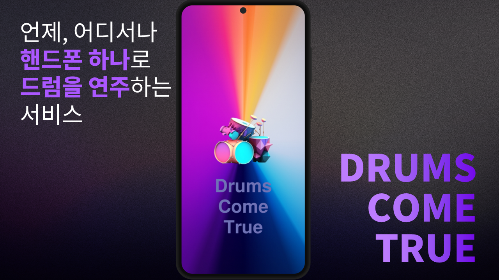
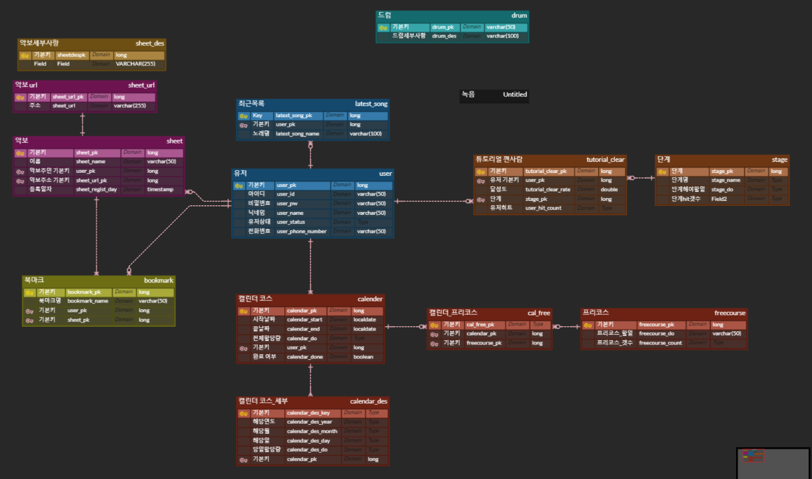

# Drums Come True: 초보자를 위한 AI 모션인식 드럼 연주 서비스

  

# 📅 프로젝트 기간
### 23.08.21 ~ 23.10.06
> **SSAFY 9기 특화프로젝트 - 모션인식 모델을 사용한 드럼 연주 서비스 앱  
개발 기간 : 23.08.21~23.10.06**

## 팀 소개

||||||
|-|-|-|-|-|-|
|팀장 우수인 FE @wbo1026
|팀원 천지호 FE @
|팀원 김나연 FE @nayeon0016
|팀원 이상욱 FE @
|팀원 정재욱 BE @wodnr8462
|팀원 이진서 BE @lalaququ
|

## 프로젝트 소개

**본 프로젝트는 사용자에게 모션 인식을 통한 드럼을 연주 할 수 있는 경험을 제공합니다.**

**Drums Come True**는 크게 다음과 같은 기능을 지원합니다
1. 자유 연주
2. 튜토리얼
3. 연습

## 시작 가이드
### 요구사항
버전에 맞는 환경이 필요합니다.

FE
|사용기술| 버전 |
|-|-|
|Kotlin|
 SDK|33

BE
|사용기술|버전|
|-|-|
| JDK | 11 |
| Springboot | 2.7.14 |
| gradle | 8.1.1 |

## 사용 기술

<table>
    <tr>
        <td><b>Back-End</b></td>
        <td>
            
            
            
            
            
            
            
            
        </td>
    </tr>
    <tr>
        <td><b>Front-End</b></td>
        <td>
            
        </td>
    </tr>
    <tr>
        <td><b>Infra</b></td>
        <td>
            
            
            
            
            
            
        </td>
    </tr>
    <tr>
        <td><b>외부 SDK</b></td>
        <td>
            
        </td>
    </tr>
    <tr>
    <tr>
        <td><b>VC</b></td>
        <td>
            
            
            
        </td>
    </tr>
    <tr>
        <td><b>Tools</b></td>
        <td>
            
            
            
            
        </td>
    </tr>
</table>

## 화면 구성

## 주요 기능
### 자유 연주
**AI 모션인식**을 통해 가상의 드럼을 실제 처럼 연주해보세요.  
**나만의 곡**을 이용해 내가 연주하고 싶었던 곡을 연주해보세요!
 
**메트로놈**을 이용하면 정확한 박자를 연습할 수 있습니다. 

### 연습
동요 음원과 악보를 통해 재미있는 게임을 즐길 수 있습니다. 
또, 메트로놈과 스네어 한개를 통해 기본적인 스냅과 박자를 익히세요!. 

### 튜토리얼
실제 드럼 연주 영상과 설명을 통해 드럼에 대한 기본지식을 익히고, 어플 사용법을 배울 수 있습니다. 

### ERD

