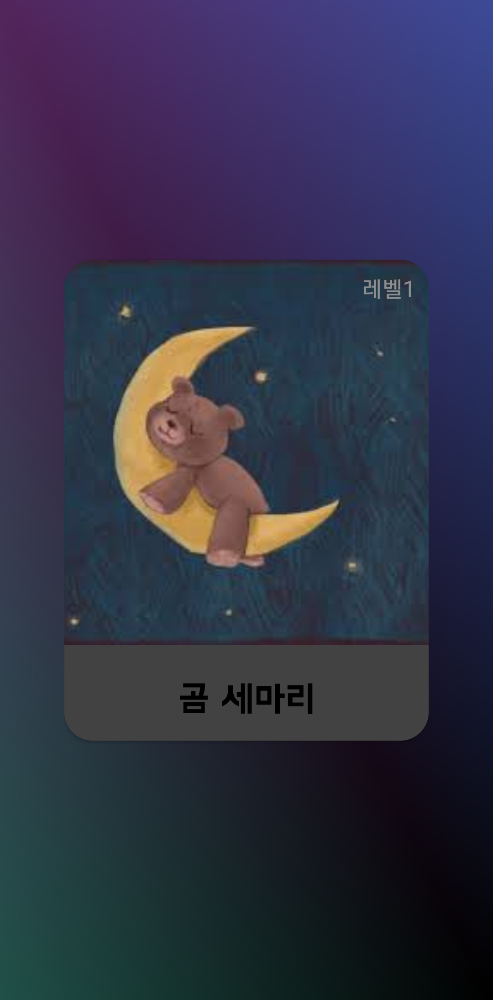

# Drums Come True: 초보자를 위한 AI 모션인식 드럼 연주 서비스

  

 

## 🥁 프로젝트 소개
<h4>SSAFY 9기 특화프로젝트 : 모션인식 모델을 사용한 드럼 연주 서비스 앱</h4>

<h4><strong>Drums Come True</strong>는 사용자에게 모션 인식을 통한 드럼을 연주 할 수 있는 경험을 제공합니다.</h4>

<h4>Drums Come True는 크게 다음과 같은 기능을 지원합니다</h4>

<h4>[Drums Come True 프로젝트 소개 UCC 보러가기](https://www.youtube.com/watch?v=0o1SzXWC2Oo)</h4>

<h4>[희소식 프로젝트 소개 UCC 보러가기](https://youtu.be/quZkcdVOYRY)</h4>

<table>
<tr> 
<th>자유 연주</th>
<th>튜토리얼</th>
<th>연습</th>
</tr>
<tr>
<td>
  
</td> 
<td>
  
</td>
<td>
  
</td>  
</tr>
</table>

## 📅 프로젝트 기간
### 23.08.21 ~ 23.10.06
 

## 👨‍👩‍👧‍👧 팀 소개

||||||
|-|-|-|-|-|-|
|팀장 우수인 FE @wbo1026
|팀원 천지호 FE @
|팀원 김나연 FE @nayeon0016
|팀원 이상욱 FE @
|팀원 정재욱 BE @wodnr8462
|팀원 이진서 BE @lalaququ
|
 

## 📃 시작 가이드
### 요구사항
버전에 맞는 환경이 필요합니다.

FE
|사용기술| 버전 |
|-|-|
|Kotlin|
 SDK|33

BE
|사용기술|버전|
|-|-|
| JDK | 11 |
| Springboot | 2.7.14 |
| gradle | 8.1.1 |
 

## ⚙ 사용 기술

<table>
    <tr>
        <td><b>Back-End</b></td>
        <td>
            
            
            
            
            
            
            
            
        </td>
    </tr>
    <tr>
        <td><b>Front-End</b></td>
        <td>
            
        </td>
    </tr>
    <tr>
        <td><b>Infra</b></td>
        <td>
            
            
            
            
            
            
        </td>
    </tr>
    <tr>
        <td><b>외부 SDK</b></td>
        <td>
            
        </td>
    </tr>
    <tr>
    <tr>
        <td><b>VC</b></td>
        <td>
            
            
            
        </td>
    </tr>
    <tr>
        <td><b>Tools</b></td>
        <td>
            
            
            
            
        </td>
    </tr>
</table>

## ⛏ 주요 활용 기술
ml 키트에 대해 적고
선정 이유 적기

 

## 🎵 주요 기능
### 1. 자유 연주
- AI 모션인식을 통해 8가지의 가상 드럼을 실제처럼 연주
- 사용자가 보유한 음원파일을 선택해 사용자가 연주하고 싶은 곡의 음악을 들으며 연주
- 메트로놈을 이용해 정확한 박자 연습

#### 1-1. 자세 잡기
- 10초 동안 초록색 선에 맞춰 자세 잡기
 

#### 1-2. 자유 연주
- 8가지의 가상 드럼을 자유자재로 연주
 

  

 

### 2. 연습하기

#### 2-1. 동요 연주하기
- 단계 별 4가지 동요 제공
- 동요 음원과 악보를 통해 재미있는 리듬 게임을 즐기기
- Good, Perfect
<table>
<tr>
<td>

</td>
<td>

</td>
<td>

</td>
<td>

</td>
</tr>
</table>

#### 2-2. 스네어 연주하기
- 메트로놈과 스네어 한개를 통해 기본적인 스냅과 박자를 익히기 

 

### 3. 튜토리얼
- 스네어, 하이햇, 베이스 연주 익히기
  - 드럼에서 가장 기본적이고 많이 사용되는 구성 요소로 드럼에 대해 집중적으로 연습
- 실제 드럼 연주 영상과 설명을 통한 기본 지식 습득
- 연습하기를 클릭해 해당하는 드럼 연주
<table>
<tr> 
<th>스네어 연주법</th>
<th>하이햇 연주법</th>
<th>베이스드럼 연주법</th>
</tr>
<tr>
<td>
  
</td> 
<td>
  
</td>
<td>
  
</td>
</tr>
<tr>
<td>
  
</td> 
<td>
  
</td>
<td>
  
</td>
</tr>
</table>

 

## ERD

